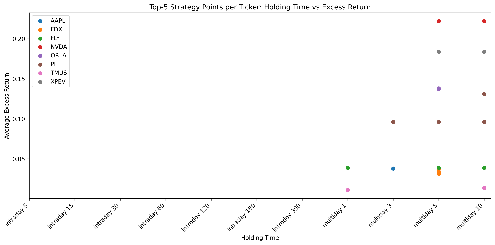
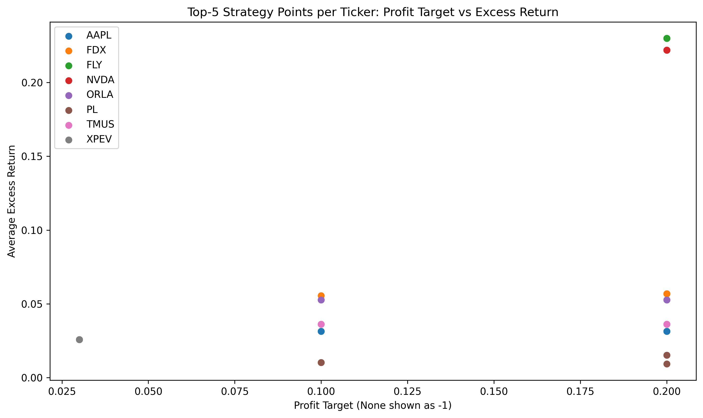
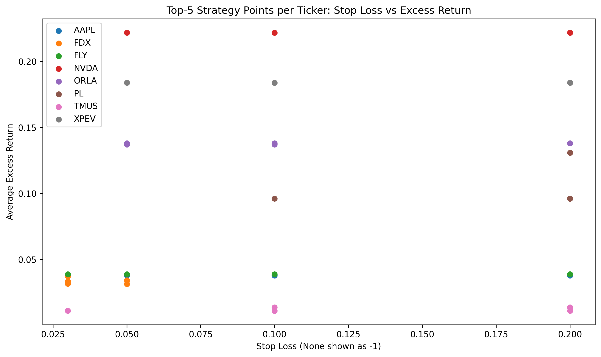
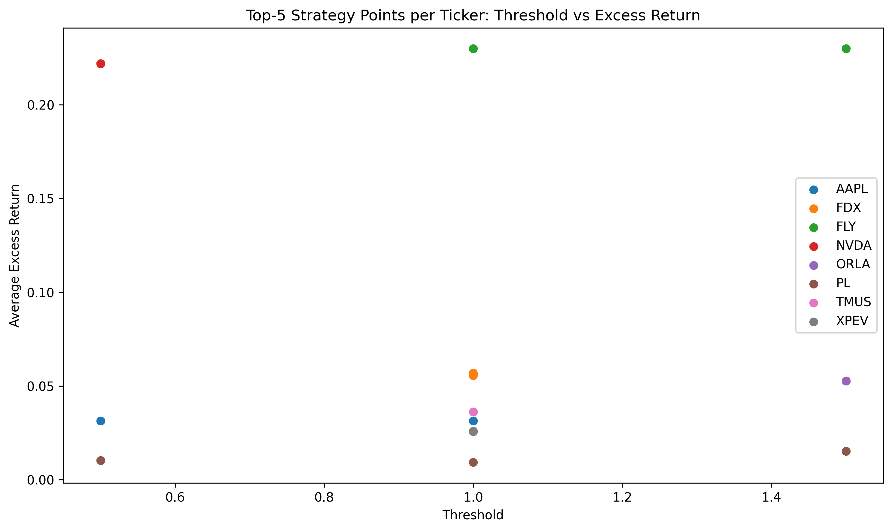

# Earnings Strategy Analysis

## 1. Project Objective

This project builds an event-driven trading strategy around earnings announcements and evaluates its performance across multiple tickers.

Core idea:

- Use pre-earnings price behavior to generate signals  
- Take long/short positions around earnings  
- Apply intraday and multi-day holding strategies  
- Measure performance relative to a market benchmark (SPY)  

The goal is to explore how different parameters affect performance:

- Threshold (signal strength)
- Stop loss
- Profit target
- Holding period

---

## 2. Script Framework

### (1) Data Layer

- Fetches:
  - Earnings events
  - Daily prices
  - Intraday (5-min) bars
- Uses chunking to handle API limits

---

### (2) Signal Construction

score = cumulative_return / (volatility * sqrt(window))
- Measures risk-adjusted momentum before earnings

Signal logic:
- if score > threshold → long
- if score < -threshold → short

---

### (3) Execution Engine

#### Intraday

- Entry: market open or earnings timestamp
- Exit:
  - stop loss
  - profit target
  - time exit

#### Multi-day

- Hold across multiple trading days
- Uses intraday path to simulate SL/PT

---

### (4) Market Benchmark

- Intraday: aligned timestamps
- Multi-day: daily approximation

---

### (5) Backtest Engine

Loops over:

- earnings events
- thresholds
- stop-loss / profit-target
- holding periods

Outputs:

- stock return
- market return
- excess return

---

## 3. Results Analysis

### (1) Holding Time vs Excess Return

Key insights:

- Multi-day strategies dominate (especially 5–10 days)
- Intraday strategies show lower returns
- Evidence of post-earnings drift (PEAD)

---

### (2) Profit Target vs Excess Return

Key insights:

- Best performance around 10%–20% profit targets
- Small targets underperform
- Suggests letting winners run

---

### (3) Stop Loss vs Excess Return

Key insights:

- Moderate stop loss (10–20%) performs better
- Tight stop loss cuts trades too early
- Earnings events exhibit high volatility

---

### (4) Threshold vs Excess Return

Key insights:

- Higher thresholds (1.0–1.5) perform better
- Stronger signals lead to higher-quality trades

---

## 4. Limitations & Future Improvements

### (1) Bars vs Trades

- Current: 5-minute bars  
- Issue: execution approximation  
- Future: use trade-level data  

---

### (2) Signal Design

Current:

- simple volatility-adjusted return

Future improvements:

- EWMA volatility
- downside volatility
- regime-aware signals

---

### (3) Transaction Costs

Currently not included:

- bid-ask spread
- slippage
- market impact

---

### (4) Cross-Sectional Strategy

Current:

- single-ticker evaluation

Future:

- rank signals across tickers
- construct long-short portfolios

---

### (5) Position Sizing

Future:

- volatility targeting
- risk budgeting

---

### (6) Earnings Features

Future enhancements:

- EPS surprise
- revenue surprise
- guidance sentiment

---

### (7) Parameter Optimization

Current:

- brute-force grid search

Future:

- Bayesian optimization
- adaptive parameter tuning

---

## Summary

This project demonstrates:

- Earnings-based signals contain predictive alpha  
- Strategy performance depends heavily on:
  - holding period
  - risk management parameters  
- Multi-day strategies outperform intraday ones  

It provides a strong foundation for building a realistic event-driven quantitative trading system.
